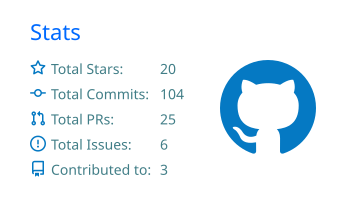
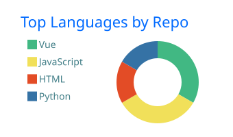

<h1 align="center">Hi, I'm BitTheCat 👋</h1>

  Software Engineer • University Student • Web Developer

  

## About me

- 🎓 University student at [UniTo — University of Turin](https://www.unito.it/)
- 💼 Currently working as a **Software Engineer** at [Hal Service](https://github.com/halservice)
- 💻 Focused on building modern web applications with Laravel and Vue.js
- 🤖 Using AI as a supporting tool throughout the software development process

## Languages and tools

  
  
  
  
  
  
  
  
  
  

## GitHub statistics

  
  

